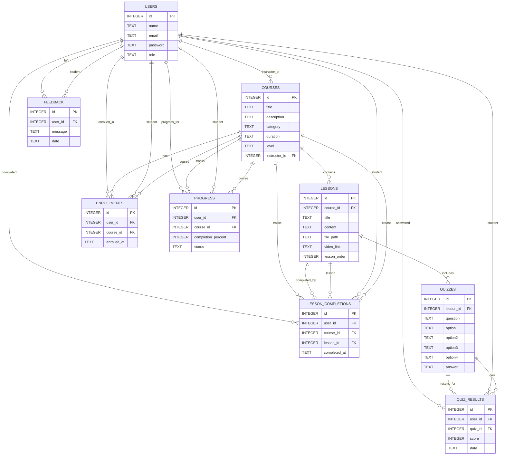

# ER Diagram for Mini Digital Learning Platform

```mermaid
erDiagram
    USERS {
        INTEGER id PK
        TEXT name
        TEXT email
        TEXT password
        TEXT role
    }

    COURSES {
        INTEGER id PK
        TEXT title
        TEXT description
        TEXT category
        TEXT duration
        TEXT level
        INTEGER instructor_id FK
    }

    LESSONS {
        INTEGER id PK
        INTEGER course_id FK
        TEXT title
        TEXT content
        TEXT file_path
        TEXT video_link
        INTEGER lesson_order
    }

    LESSON_COMPLETIONS {
        INTEGER id PK
        INTEGER user_id FK
        INTEGER course_id FK
        INTEGER lesson_id FK
        TEXT completed_at
    }

    ENROLLMENTS {
        INTEGER id PK
        INTEGER user_id FK
        INTEGER course_id FK
        TEXT enrolled_at
    }

    QUIZZES {
        INTEGER id PK
        INTEGER lesson_id FK
        TEXT question
        TEXT option1
        TEXT option2
        TEXT option3
        TEXT option4
        TEXT answer
    }

    QUIZ_RESULTS {
        INTEGER id PK
        INTEGER user_id FK
        INTEGER quiz_id FK
        INTEGER score
        TEXT date
    }

    PROGRESS {
        INTEGER id PK
        INTEGER user_id FK
        INTEGER course_id FK
        INTEGER completion_percent
        TEXT status
    }

    FEEDBACK {
        INTEGER id PK
        INTEGER user_id FK
        TEXT message
        TEXT date
    }

    USERS ||--o{ COURSES : "instructor_of"
    USERS ||--o{ ENROLLMENTS : "enrolled_in"
    USERS ||--o{ QUIZ_RESULTS : "answered"
    USERS ||--o{ PROGRESS : "progress_for"
    USERS ||--o{ FEEDBACK : "left"
    USERS ||--o{ LESSON_COMPLETIONS : "completed"

    COURSES ||--o{ LESSONS : "contains"
    COURSES ||--o{ ENROLLMENTS : "has"
    COURSES ||--o{ PROGRESS : "tracks"
    COURSES ||--o{ LESSON_COMPLETIONS : "tracks"

    LESSONS ||--o{ QUIZZES : "includes"
    LESSONS ||--o{ LESSON_COMPLETIONS : "completed_by"

    QUIZZES ||--o{ QUIZ_RESULTS : "results_for"

    LESSON_COMPLETIONS }o--|| LESSONS : "lesson"
    LESSON_COMPLETIONS }o--|| USERS : "student"
    LESSON_COMPLETIONS }o--|| COURSES : "course"

    ENROLLMENTS }o--|| USERS : "student"
    ENROLLMENTS }o--|| COURSES : "course"

    QUIZ_RESULTS }o--|| USERS : "student"
    QUIZ_RESULTS }o--|| QUIZZES : "quiz"

    PROGRESS }o--|| USERS : "student"
    PROGRESS }o--|| COURSES : "course"

    FEEDBACK }o--|| USERS : "student"
```